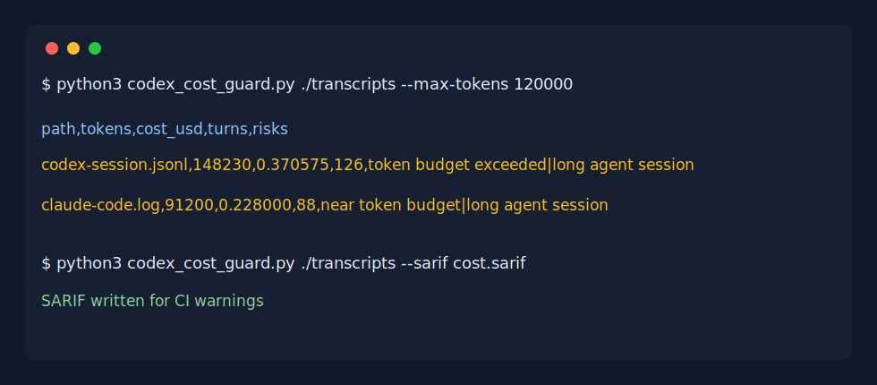

# codex-cost-guard

[English README](README.md)

不要等到账单出来以后，才发现 Codex、Claude Code、Cursor 或 Copilot agent session 已经烧掉了太多 token。

`codex-cost-guard` 是一个零依赖 CLI，用来从本地 agent transcript / log 中估算 token 消耗，标记失控 session，并输出文本、JSON 和 SARIF，方便接入 CI。

> 非官方项目。本仓库与 OpenAI、Anthropic、Cursor、GitHub 或 Microsoft 没有关联。相关产品名称仅用于说明兼容场景。

## Demo



## 快速开始

```bash
python3 codex_cost_guard.py ./transcripts --max-tokens 120000
```

输出 JSON：

```bash
python3 codex_cost_guard.py ./transcripts --json
```

输出 SARIF：

```bash
python3 codex_cost_guard.py ./transcripts --sarif codex-cost-guard.sarif
```

## 为什么有用

AI coding agent 很容易进入长循环、塞入巨大的上下文，或者让多个 agent 并行工作。这个工具可以在本地快速估算 transcript 的 token 消耗和潜在成本，避免“跑完才知道很贵”。

它会估算：

- transcript 字符数
- 粗略 token 数
- 按你设定的每百万 token 价格估算成本
- 对话轮数
- 过大上下文、过长 session 等风险

## GitHub Actions 集成

```yaml
name: Agent Cost Guard

on:
  pull_request:

jobs:
  cost:
    runs-on: ubuntu-latest
    steps:
      - uses: actions/checkout@v4
      - name: Estimate agent transcript cost
        run: python3 codex_cost_guard.py ./transcripts --sarif codex-cost-guard.sarif || true
```

## 输出格式

- 本地文本表格
- JSON，适合脚本和 dashboard
- SARIF，适合 CI 警告

## 路线图

- 更多 agent transcript 格式的原生解析
- 不同模型的价格预设
- HTML 成本报告
- GitHub PR 评论模式

## License

MIT
